<!doctype html>
<html lang="en-GB"><head><meta charset="utf-8"><meta name="viewport" content="width=device-width,initial-scale=1">
<title>Juswrk — Engineering Delivered Nationwide</title><meta name="description" content="National retail rollouts, electrical, utilities, CCTV and specialist project delivery across the UK.">
</head>
<body>
<header class="header">
<a class="brand" href="index.html">juswrk<i>.</i></a><nav class="links"><a href="shopfitting.html">Shopfitting</a><a href="electrical.html">Electrical</a><a href="systems.html">Systems</a><a href="coverage.html">Coverage</a><a class="cta" href="contact.html">Start a project</a></nav>
</header>
<main>
<section class="hero">
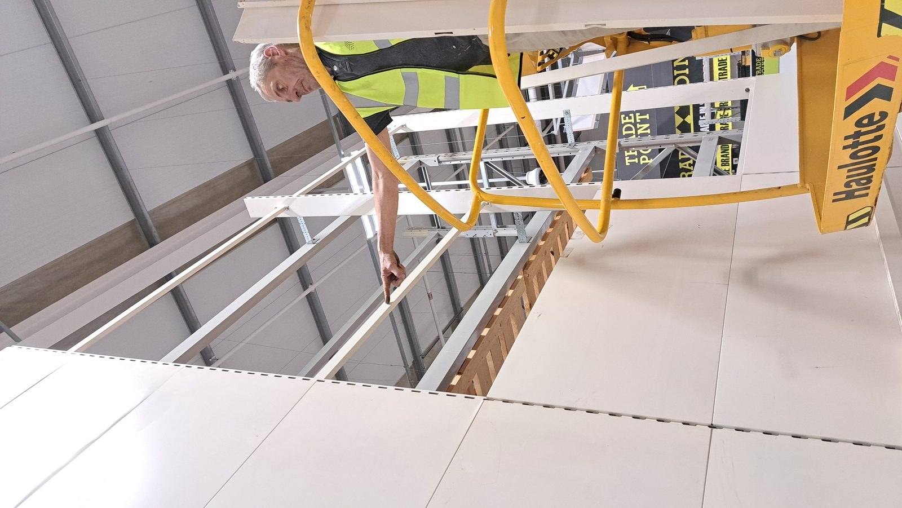

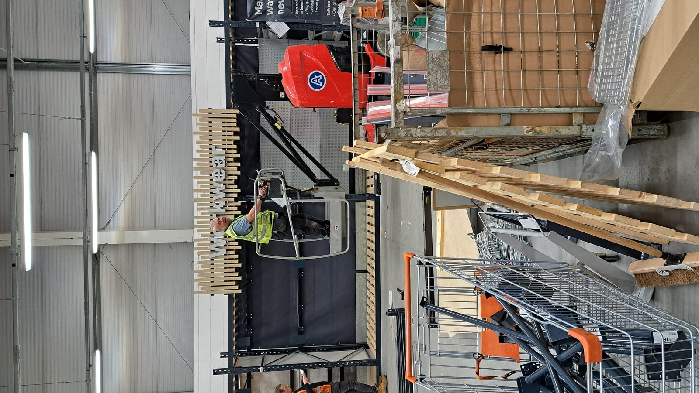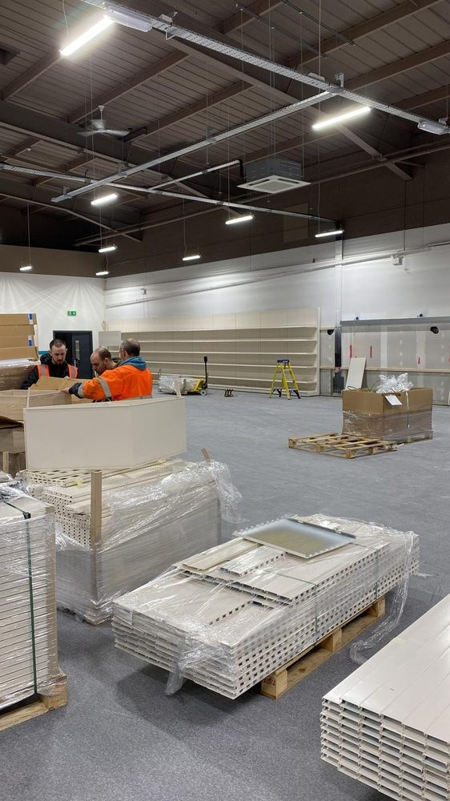

M & E Contractors · National Project Delivery
<h1>Built to deliver.</h1>
National retail rollouts, commercial electrical, utilities, CCTV and connected systems—delivered by people with genuine site experience.

<a class="btn primary" href="projects.html">See the work</a><a class="btn ghost" href="coverage.html">Explore coverage</a>

<b>270+</b>Project trips

<b>100+</b>UK locations

<b>National</b>Rollout experience

<b>Highlands</b>to Isle of Wight

</section>
<section class="intro">

Choose the capability
<h2>See it. Click it. Explore it.</h2>

The work leads the website. Every service opens through real project photography, with teal overlays keeping the navigation bold, clear and unmistakably Juswrk.

</section>
<section class="sectors">
<a class="tile" href="shopfitting.html">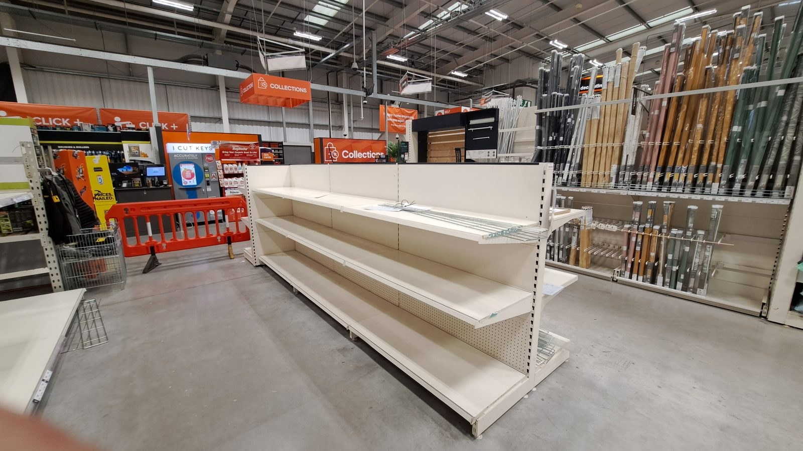

Featured capability
<h3>National Retail Rollouts</h3>
Gondolas, racking, lighting rafts, store refreshes and multi-site programmes.

</a><a class="tile" href="electrical.html">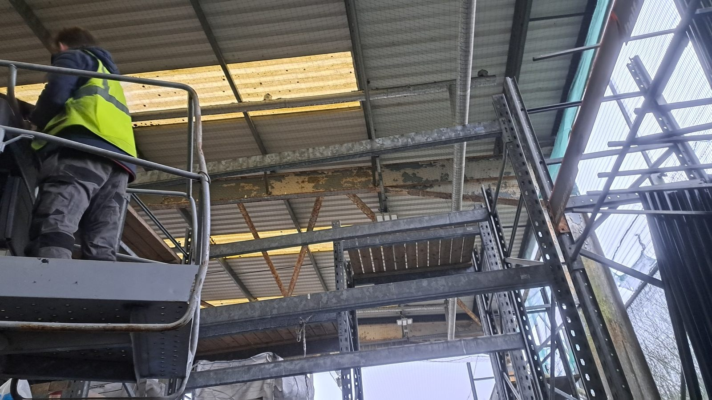
<h3>Electrical</h3>
Commercial and industrial delivery.

</a><a class="tile" href="systems.html">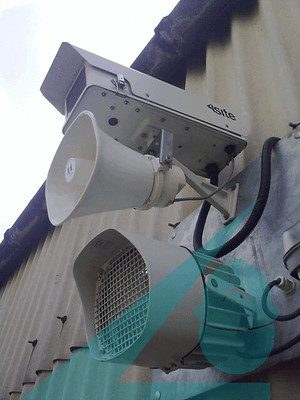
<h3>CCTV & Connected Systems</h3>
Security, monitoring and integration.

</a><a class="tile" href="projects.html">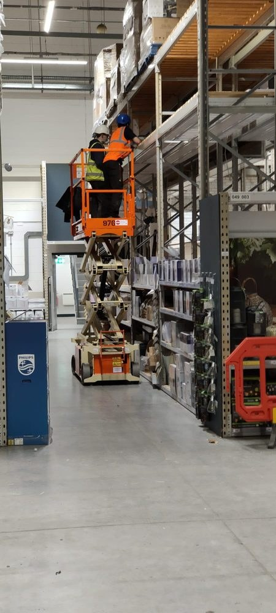
<h3>Project Gallery</h3>
</a><a class="tile" href="capabilities.html">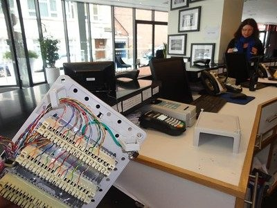
<h3>Utilities & Infrastructure</h3>
</a><a class="tile" href="coverage.html">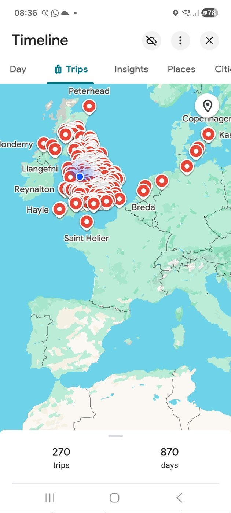
<h3>UK Coverage</h3>
</a>
</section>

National Rollouts &nbsp;•&nbsp; Electrical &nbsp;•&nbsp; Utilities & Water &nbsp;•&nbsp; CCTV &nbsp;•&nbsp; Automation &nbsp;•&nbsp; Digital Signage &nbsp;•&nbsp; National Rollouts &nbsp;•&nbsp; Electrical &nbsp;•&nbsp; Utilities & Water &nbsp;•&nbsp; CCTV &nbsp;•&nbsp; Automation &nbsp;•&nbsp; Digital Signage &nbsp;•&nbsp;

<section class="proof">

Real project photography
<h2>Proof before promises.</h2>

No generic construction imagery. The portfolio is built around site work, installations and completed projects.

<figure>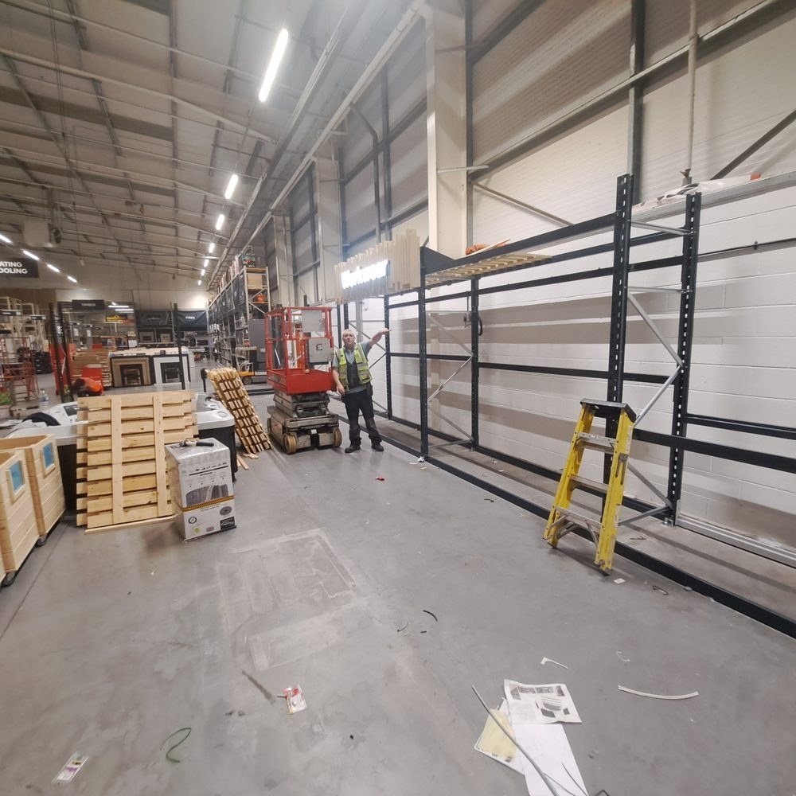<figcaption>Retail rollout delivery</figcaption></figure><figure>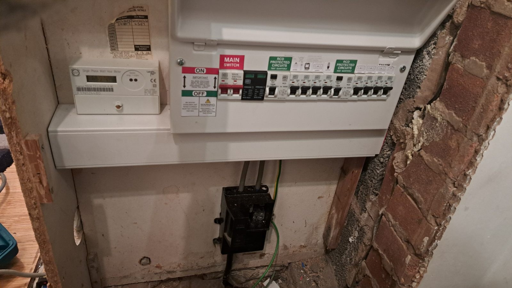<figcaption>Electrical installation</figcaption></figure><figure>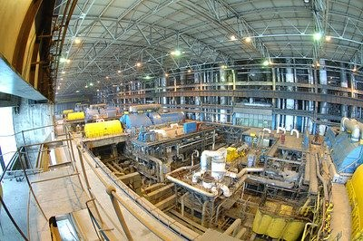<figcaption>Connected systems</figcaption></figure><figure>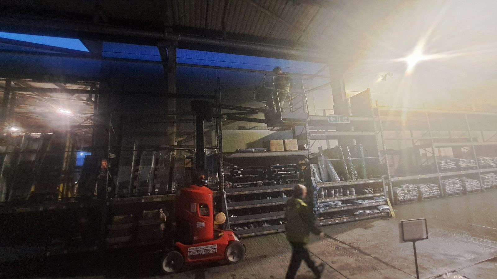<figcaption>Store works</figcaption></figure><figure>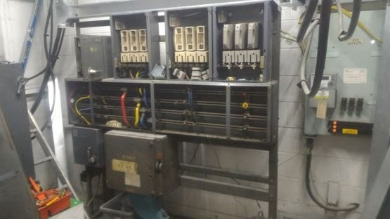<figcaption>Site engineering</figcaption></figure>

</section>
<section class="network">

One connected ecosystem
<h2>People. Projects. Security.</h2>
<a class="network-card" href="https://juswrk.github.io/m-hub/">
Capability network
<h3>M-Hub</h3>
Engineer profiles, CVs, qualifications and verified experience.
</a><a class="network-card" href="https://juswrk.github.io/mh-control/">
Project platform
<h3>MH-Control</h3>
Project dashboards, records, RAMS, surveys and operational control.
</a><a class="network-card" href="https://juswrk.github.io/siteguard/">
Security division
<h3>SiteGuard</h3>
CCTV, monitoring, access control and temporary site protection.
</a>

</section>
</main><footer class="footer">

juswrk<i>.</i>

<a href="projects.html">Projects</a><a href="coverage.html">Coverage</a><a href="contact.html">Contact</a><a href="mailto:info@juswrk.org">info@juswrk.org</a>

</footer></body></html>